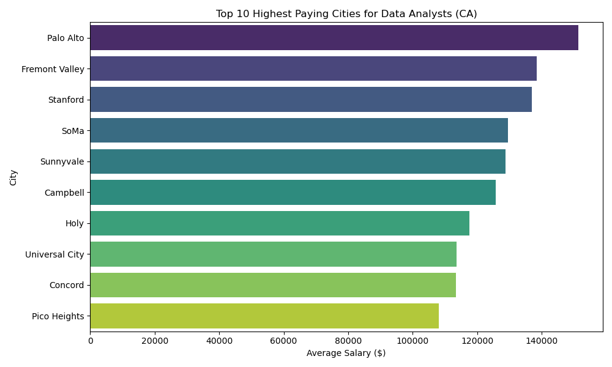

# California Job Market Analysis: Data Analyst Roles

## Data Visualization

I built an automated ETL (extract, transform, load) pipeline that pulls live job market data from the Adzuna API, which cleans the data using Python and stores it in a secure PostgreSQL database for further analysis. 
The Tech Stack: Python - Data extraction and transformation(pandas). PostgreSQL - Relational databese for storage. SQLAlchemy - Database for Python to SQL communication. Seaborn/Matplotlib - Automated data visualization. 
Technical Challanges & Solutions: Database Conlict Resolution - Identified and resolved a port conflict between multiple PostgreSQL instances (Homebrew vs. Enterprise) to ensure the pipeline hit the correct production server. Security Configuration - Configured scram-sha-256 authentication in the pg_hba.conf file to ensure secure database access. Data Cleaning - Handled inconsistent API salary data by converting strings to numeric values and filtering out outliers/incomplete entries. 
