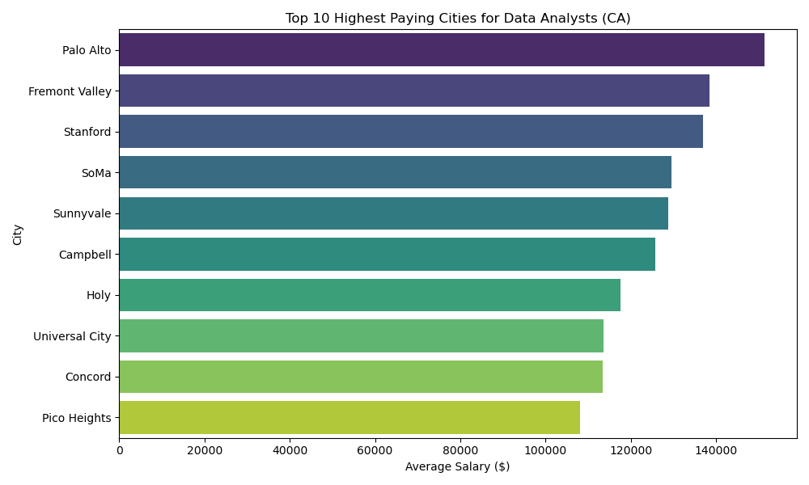

# CA Job Market Analysis

## 🚀 Project Overview
Built an automated **ETL (Extract, Transform, Load)** pipeline that pulls live job market data from the Adzuna API, cleans the data using Python, and stores it in a secure PostgreSQL database for further analysis.

## 💻 Tech Stack
* **Language:** Python (Pandas)
* **Database:** PostgreSQL, SQLAlchemy
* **Visualization:** Matplotlib, Seaborn
* **Data Source:** Adzuna API

## 🧠 Technical Challenges & Solutions
### Database Conflict Resolution
* **Issue:** Identified and resolved a port conflict between multiple PostgreSQL instances (Homebrew vs. Enterprise).
* **Solution:** Configured instances to ensure the pipeline hit the correct production server.

### Security & Data Integrity
* **Authentication:** Configured `scram-sha-256` authentication in the `pg_hba.conf` file to ensure secure database access.
* **Data Cleaning:** Handled inconsistent API salary data by converting strings to numeric values and filtering out outliers/incomplete entries.
